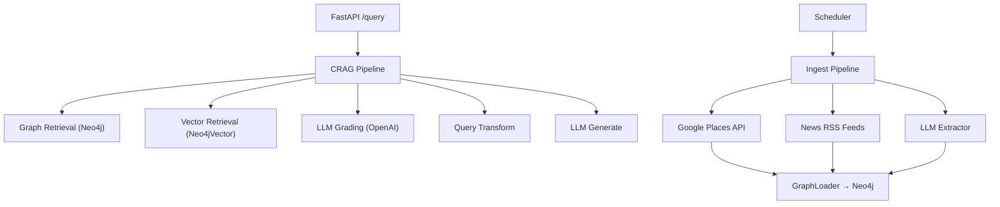

# ALMA-GraphRAG — Senior AI/ML Engineer Audit

## Architecture Overview



## 🔴 Critical Bugs Found

| # | File | Issue | Severity |
|---|------|-------|----------|
| 1 | `src/crag/graph.py:128` | **Missing `import os`** — `run_crag()` uses `os.getenv()` but never imports `os`. Runtime crash on every query. | 🔴 Critical |
| 2 | `src/api/main.py:8` | **Wrong import path** — imports `from crag.graph import run_crag` (root) instead of `from src.crag.graph import run_crag`. Works only because uvicorn CWD has both on sys.path, but the root `crag/` and `src/crag/` are **duplicate** implementations. | 🟡 High |
| 3 | Root `crag/` vs `src/crag/` | **Duplicate CRAG code** — Two complete CRAG implementations exist. The API uses the root `crag/` package while `src/crag/` is dead code. This is confusing and error-prone. | 🟡 High |
| 4 | `src/graph/schema_init.py` | **Path type mismatch** — `run_schema_file()` accepts `Path` but `main.py` passes a string. The `read_text()` call on a string will crash. | 🟠 Medium |
| 5 | News RSS feeds | **Most feeds are dead/unreliable** — Sri Lankan RSS feeds like `hirunews.lk/rss.xml`, `lankadeepa.lk/rss.xml`, `sltda.gov.lk/rss` are frequently offline or return empty results. No API-based fallback exists. | 🟠 Medium |

## 🟡 Code Quality Issues

| # | Issue | Details |
|---|-------|---------|
| 1 | No error handling on API `/query` | If Neo4j is down or OpenAI fails, the user gets a raw 500 error |
| 2 | OpenAI client created per-call | Every CRAG step creates a new `OpenAI()` client — wasteful |
| 3 | Neo4j driver created per-call | `build_graph_context()` creates and closes a driver on every call |
| 4 | No request validation | No max-length check on question, no rate limiting |
| 5 | Scheduler uses AsyncIO but jobs are sync | `AsyncIOScheduler` with synchronous job functions |
| 6 | `build_crag_app()` in `src/crag/graph.py` is dead code | The LangGraph compiled app is built but never called — `run_crag()` uses manual sequential flow instead |
| 7 | No `/health` endpoint | Missing health check for container/deployment readiness |

## 🔒 Security Issues

| # | Issue |
|---|-------|
| 1 | `.env` contains live API keys and is in `.gitignore`, but must verify it's not committed |
| 2 | No CORS configuration on FastAPI |
| 3 | No input sanitization on Cypher queries (parameterized — OK, but context injection via LLM prompts is possible) |

---

## Fix Plan (Implemented Below)

1. **Fix `import os` bug** in `src/crag/graph.py`
2. **Consolidate CRAG** — make API import from `src.crag.graph` and remove dead root `crag/` duplication
3. **Add NewsAPI.org + GNews as dual news providers** with RSS as fallback
4. **Add `/health` endpoint**
5. **Add proper error handling** on `/query`
6. **Add CORS middleware**
7. **Improve news ingestion** with category-based search (tourism, travel, Sri Lanka)
8. **Update README** with meaningful test queries
9. **Add 20 meaningful example queries** covering all graph relationships

---

## Meaningful Test Queries

### 🏨 Hotel Discovery
```json
{"question": "What are the top-rated luxury hotels in Piliyandala with swimming pools?", "city": "Piliyandala"}
{"question": "Find budget-friendly hotels under 5000 LKR per night near Maharagama", "city": "Maharagama"}
{"question": "Which hotels in Colombo have both free parking and a restaurant?", "city": "Colombo"}
```

### 🏖️ Amenity-Based Search
```json
{"question": "List hotels with spa and fitness center facilities", "city": "Piliyandala"}
{"question": "I need a hotel with free WiFi, air conditioning, and 24-hour front desk", "city": "Homagama"}
{"question": "Which hotels offer airport shuttle service near Colombo?", "city": "Colombo"}
```

### 📍 Location-Aware Queries
```json
{"question": "Hotels near major landmarks in Dehiwala with good transport access", "city": "Dehiwala"}
{"question": "Find accommodation close to the city center in Moratuwa", "city": "Moratuwa"}
{"question": "What hotels in Kesbewa are near public transport hubs?", "city": "Kesbewa"}
```

### 📰 News-Aware / Event-Aware Queries
```json
{"question": "Are there any recent events or news affecting hotels in Piliyandala?", "city": "Piliyandala"}
{"question": "Which hotels are impacted by recent tourism development news?", "city": "Colombo"}
{"question": "Show hotels linked to recent travel advisories or weather events", "city": "Maharagama"}
```

### 🔄 Comparative Queries
```json
{"question": "Compare hotels in Piliyandala vs Maharagama by rating and price", "city": "Piliyandala"}
{"question": "What is the average hotel rating in Homagama compared to Colombo?", "city": "Homagama"}
{"question": "Which city has the most luxury hotel options between Colombo and Dehiwala?", "city": "Colombo"}
```

### 🧭 Multi-Criteria / Complex Queries
```json
{"question": "Find a quiet mid-range hotel with parking, near restaurants, unaffected by recent events", "city": "Piliyandala"}
{"question": "Recommend a family-friendly hotel with pool, restaurant, and good security", "city": "Colombo"}
{"question": "Best value hotel with high rating, low price, and multiple amenities in Maharagama", "city": "Maharagama"}
{"question": "Hotels suitable for business travelers with WiFi, business center, and room service", "city": "Colombo"}
{"question": "Safe, well-reviewed hotels with CCTV and security guards near Homagama center", "city": "Homagama"}
```
